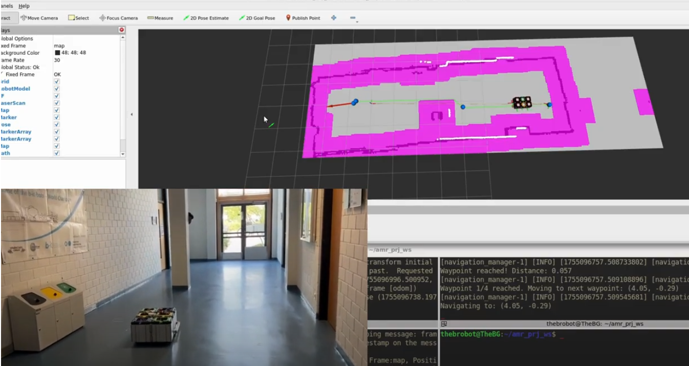

# Intelligent Mobile Robot

## Overview
This repository contains the software for the Autonomous Mobile Robot (AMR) project developed for the amr-ss25 course at HBRS. The project's goal is to enable a Robile platform to autonomously navigate and map an unknown environment using ROS 2 Humble on Ubuntu 22.04. The core functionalities implemented are a hybrid navigation system, custom localization, and autonomous exploration.

## Features
- Hybrid Navigation: Combines an A* global path planner with a potential field local planner for robust, real-time obstacle avoidance.

- Custom Monte Carlo Localization (MCL): A particle filter-based localization node built from scratch to provide accurate pose estimation in a known environment.

- Frontier-Based Exploration: An exploration module that uses a scoring function to guide the robot toward the boundaries of unknown areas, enabling it to autonomously build a complete map.

- Simulation: The system can be tested in a Gazebo simulation environment before being deployed on the physical robot.

## Repository structure
```
amr-ss25-projects-intelligent-bots/
|-- src/
|   |-- robile_description/
│   |-- robile_explorer/
│   |-- robile_gazebo/
│   |-- robile_interfaces/
│   |-- robile_localization/
│   |-- robile_path_planner/
|-- README.md
|-- .gitignore
|-- LICENSE
```

The core project functionality is distributed across these ROS 2 packages within the src directory, with each package responsible for a specific aspect of the robot's autonomy.
- robile_path_planner contains the hybrid planner nodes.
- robile_localization contains the MCL particle filter node.
- robile_explorer contains the autonomous exploration.
  
---  
## Getting Started

### Prerequisites
- Ubuntu 22.04
- ROS 2 Humble
- Colcon build tools

### Building the Workspace

1. Clone this repository into your ROS 2 workspace src directory:
   ```
   cd ~/ros2_ws/src
   git clone https://github.com/HBRS-AMR/amr-ss25-projects-intelligent-bots.git
   ```
2. Navigate to the root of your workspace and build the packages:

   ```
   cd ~/ros2_ws
   colcon build
   ```
3. Source the workspace to make the packages available:
   ```
   source install/setup.bash
   ```
---
## Usage Instructions

### Running in Simulation
To run the robot in simulation:
```bash
cd <your_ws>
export GAZEBO_MODEL_PATH=./src/robile_gazebo/models
ros2 launch robile_gazebo gazebo_4_wheel.launch.py
````

---

### Running on Real Robot

First, SSH into the Robile robot:

```bash
ssh studentkelo@<robile_ip>
```

Then, bring up the robot base:

```bash
cd ~/ros2ws/
source install/setup.sh
ros2 launch robile_bringup robot.launch.py
```

---

### Task 1 – Path and Motion Planning (AMCL)

1. Run the localization node:

   ```bash
   ros2 launch robile_localization amcl_localization.launch.py
   ```
2. In another terminal, run the navigation stack:

   ```bash
   ros2 launch robile_path_planner amr_navigation_launch.py localization_source:=amcl
   ```

---

### Task 2 – Custom Monte Carlo Localization (MCL)

Run the MCL localization node:

```bash
ros2 launch robile_localization mcl_localisation.launch.py
```

Don’t forget to provide the **initial pose** (via RViz or CLI).

---

### Task 3 – Environment Exploration (with SLAM)

1. Run SLAM to generate the map:

   ```bash
   ros2 run robile_localization slam.launch.py
   ```
2. In another terminal, run the navigation stack with SLAM localization:

   ```bash
   ros2 launch robile_path_planner amr_navigation_launch.py localization_source:=slam
   ```
3. In a third terminal, start the exploration node:

   ```bash
   ros2 run robile_explorer exploration_node.py
   ```
---
## Resources
- code: github
- video: https://youtu.be/cXD8E2jGFP0
- project report


